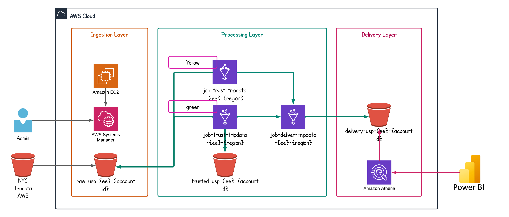

# NYC Tripdata ETL Project

## Overview

This project provides an ETL (Extract, Transform, Load) solution for processing NYC tripdata using AWS Glue, Athena, EC2 instances, and S3 buckets. The entire infrastructure is automatically provisioned using Terraform.

## Architecture

## Features

- **Data Extraction**: Extracts NYC tripdata from S3 buckets.
- **Data Transformation**: Utilizes AWS Glue for data transformation tasks.
- **Data Loading**: Loads transformed data into S3 buckets.
- **Data Querying**: Leverages AWS Athena for querying the processed data.
- **Orchestration**: Uses AWS Glue workflows to orchestrate jobs for each step, following the medallion architecture.
- **Automation**: Infrastructure is automatically generated and managed using Terraform.

## Prerequisites

- AWS Account
- Terraform installed
- AWS CLI configured
- Necessary IAM permissions to create and manage AWS resources
